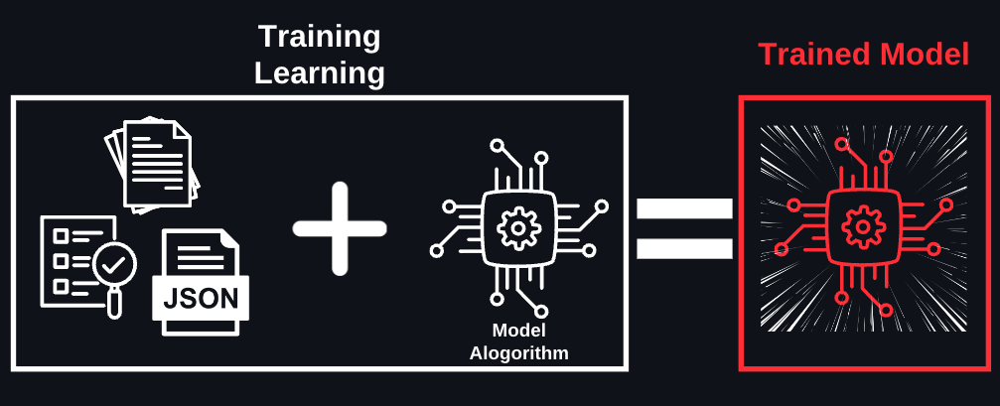

# ML 개발

계산용 관계용 속성: ML 개발 (ML%20%EA%B0%9C%EB%B0%9C%206d35549d352882fe820781a0c08421e1.md), 생성형 AI 기초 (%EC%83%9D%EC%84%B1%ED%98%95%20AI%20%EA%B8%B0%EC%B4%88%201b05549d352882a7bb8a0176dc08eef8.md), Responsible AI, AI를 책임감있게 만드는 방식 (Responsible%20AI,%20AI%EB%A5%BC%20%EC%B1%85%EC%9E%84%EA%B0%90%EC%9E%88%EA%B2%8C%20%EB%A7%8C%EB%93%9C%EB%8A%94%20%EB%B0%A9%EC%8B%9D%206a55549d352882568ac581afc55e9ed2.md), AI 솔루션을 위한 보안, 규정 준수, 거버넌스 (AI%20%EC%86%94%EB%A3%A8%EC%85%98%EC%9D%84%20%EC%9C%84%ED%95%9C%20%EB%B3%B4%EC%95%88,%20%EA%B7%9C%EC%A0%95%20%EC%A4%80%EC%88%98,%20%EA%B1%B0%EB%B2%84%EB%84%8C%EC%8A%A4%208f85549d35288228915301798c5ba83f.md), FM 활용과 프롬프트 엔지니어링 (FM%20%ED%99%9C%EC%9A%A9%EA%B3%BC%20%ED%94%84%EB%A1%AC%ED%94%84%ED%8A%B8%20%EC%97%94%EC%A7%80%EB%8B%88%EC%96%B4%EB%A7%81%20acc5549d352883199ea481da95436968.md), 제목 없음 (https://www.notion.so/33e2156ceb5f8014b59cec7d37102f7a?pvs=21), 제목 없음 (https://www.notion.so/33e2156ceb5f801599aad8f0ceb4bd45?pvs=21), FM 성능 평가 방법 (FM%20%EC%84%B1%EB%8A%A5%20%ED%8F%89%EA%B0%80%20%EB%B0%A9%EB%B2%95%20bd65549d35288268ad6c0161817fff5c.md), 제목 없음 (https://www.notion.so/33e2156ceb5f8011ad9ec19a39320eb5?pvs=21)
문제수: 46
분류: 콘텐츠
비중: 14.1%
합계: 326

<aside>
💡

좋은 요리를 만들려면 신선한 재료와 좋은 주방 도구가 필요하듯이, 좋은 AI 모델을 만들려면 양질의 데이터와 적절한 컴퓨팅 파워가 필요합니다. 여기서는 ML 모델을 실제로 개발하는 과정을 처음부터 끝까지 살펴보겠습니다. 어떤 컴퓨터가 필요한지, 데이터는 어떻게 준비하는지, 그리고 모델은 어떻게 훈련시키는지 하나씩 알아볼게요.

</aside>

### ML 개발을 위한 컴퓨팅 파워

- Amazon EC2는 클라우드에서 사용할 수 있는 가상 컴퓨터입니다. 여러분이 게임용 PC를 고를 때처럼, AI 개발에도 목적에 맞는 성능의 컴퓨터가 필요합니다. AWS는 다양한 종류의 인스턴스를 제공하는 데, 비슷한 종류를 묶어 패밀리라고 부릅니다. 다양한 패밀리 중에서도 AI 개발과 관련된 패밀리를 소개하면 아래와 같습니다.
    
    
    | EC2 패밀리 | 설명 | 적합한 작업 |
    | --- | --- | --- |
    | C series | 컴퓨팅 최적화 인스턴스로, 고성능 컴퓨팅이 필요한 워크로드(작업)에 적합
    CPU 성능이 중요한 애플리케이션을 위해 설계됨 | 데이터 전처리
    간단한 ML 모델 학습/추론
    일반적인 연산 작업 |
    | G series | **GPU 탑재**로 그래픽 처리와 기계 학습 워크로드에 적합
    고성능 GPU를 활용한 연산에 특화됨 | 이미지 처리
    비디오 분석
    중간 규모 딥러닝 |
    | P series | **최고급 GPU**를 탑재한 **고성능** AI
    딥 러닝 훈련과 같은 대규모 병렬 처리가 필요한 워크로드에 이상적 | 대규모 딥러닝
    복잡한 AI 모델 학습
    실시간 영상 처리 |
    | Trn series | **AWS Trainium 칩**을 사용하여 AI 학습에 최적화된 특수 설계
    **에너지 효율적**이고, 환경 영향을 최소화하면서도 **LLM 학습에 최적화** | 대형 언어 모델 학습/추론 |

### ML 시스템 개발 프로세스

<aside>
💡

(영화 추천 서비스 개발 사례를 중심으로)

**머신러닝의 본질적 개념**
머신러닝은 **데이터**를 기반으로 패턴을 **학습**하고 이를 통해 **새로운 상황에서 의사결정**을 수행하는 시스템입니다. 전통적인 프로그래밍이 명시적인 규칙을 통해 동작하는 것과 달리, 머신러닝은 데이터에서 자동으로 규칙을 도출하여 문제를 해결합니다.

**개발 프로세스의 주요 단계**

- **1. 데이터 엔지니어링**
    
    데이터는 머신러닝 시스템의 기반이 되며, 시스템의 성능을 좌우하는 핵심 요소입니다(feat. Garbage in, Garbage out). 영화 추천 서비스의 경우 사용자의 시청 기록, 평점 데이터, 콘텐츠 메타데이터 등이 주요 데이터가 됩니다. 이 단계에서는 **데이터 수집, 전처리(pre-processing), 탐색적 데이터 분석(Exploratory data analysis), 피처(Feature, 특성, 변수) 엔지니어링** 등이 수행됩니다. 
    
    **1.1. 데이터의 주요 유형 (Data Types)**
    
    해결하려는 문제의 성격에 따라 수집해야 하는 데이터의 형태가 달라집니다. ML 모델 학습을 위해서는 적절한 데이터 유형을 선택하는 것이 필수적입니다.
    
    | 유형 | 설명 |
    | --- | --- |
    | 정형 데이터 
    (Tabular Data) | **행(Row)과 열(Column)**로 구성된 구조화된 데이터(예: 엑셀)
    고객의 인구통계 정보나 구매 이력을 기반으로 한 광고 최적화 등에 사용됩니다. |
    | 시계열 데이터 
    (Time Series Data) | **시간의 순서**대로 기록된 데이터
    주가 예측이나 시간대별 인터넷 속도 변화 분석처럼 트렌드와 패턴 파악이 중요할 때 사용됩니다. |
    | 텍스트 데이터 
    (Text Data) | **자연어로 된 비정형** 데이터
    소셜 미디어 감성 분석이나, AI 어시스턴트를 위한 대화형 데이터(전문 용어 포함) 학습에 필요합니다. |
    | 이미지 데이터 
    (Image Data) | 시각 정보 데이터
    자율주행(교통 표지판 인식)이나 의료 영상 분석 등에 활용됩니다. |
    
    **1.2. 주요 데이터 준비 및 전처리 단계 (Data Preparation Steps)**
    
    데이터 수집 후 모델이 학습할 수 있는 상태로 만드는 과정입니다. 각 단계의 목적을 구분하는 것이 중요합니다.
    
    | 특성 | 정의 | 예시 |
    | --- | --- | --- |
    | 데이터 레이블링
    (Labeling) | 지도 학습을 위해 데이터(입력)에 정답(태그, 카테고리)을 부여하는 작업 | 거래 내역에 '개인' 또는 '기업'이라는 분류를 삽입하는 것
    사진에 '고양이'라고 태그를 다는 것. |
    | 데이터 인코딩 
    (Encoding) | 컴퓨터가 이해할 수 있도록 문자(텍스트) 데이터를 숫자(수치) 데이터로 변환하는 작업 | 'Red, Green, Blue' 색상 정보를 `[1, 0, 0]`, `[0, 1, 0]` 처럼 0과 1의 숫자로 변경(One-hot encoding). |
    | 데이터 정규화 
    (Normalization) | 서로 다른 범위(Scale)를 가진 수치형 데이터들의 단위를 일정하게 맞추는(스케일링) 작업 | 나이(0~100세)와 연봉(0~1억 원)을 모두 **0과 1 사이의 값**으로 변환하여, 특정 변수가 학습에 과도한 영향을 미치는 것을 방지함 |
    | 데이터 밸런싱 
    (Balancing) | 특정 클래스의 데이터가 너무 적거나 많을 때, 비율을 맞춰주는 작업 | 암 환자 데이터와 정상인 데이터의 비율이 1:99일 때, 암 환자 데이터를 늘리거나(Oversampling) 정상인 데이터를 줄여서(Undersampling) 균형을 맞춤 |
    
    > 💡 대규모 데이터의 자동 레이블링 방법
     대량의 레이블이 없는 데이터를 보유한 경우, 다음과 같은 자동화된 방법으로 레이블을 생성할 수 있습니다.
    > 
    > 
    > 
    > | 방법 | 설명 |
    > | --- | --- |
    > | 배치 추론
    > (Batch Inference) | 사전 학습된 모델을 사용하여 대규모 데이터에 자동으로 레이블을 생성. 대량 처리에 적합 |
    > | SageMaker AI 레이블링 | 인간 검토자 또는 자동화된 워크플로를 통해 데이터를 레이블링하는 관리형 서비스 |
    
    **1.3. 데이터셋 품질 평가 기준**
    
    수집된 데이터의 품질을 평가하는 것은 모델 성능에 직접적인 영향을 미치므로 매우 중요합니다. 주요 평가 기준은 다음과 같습니다.
    
    | 특성 | 설명 | 체크포인트 |
    | --- | --- | --- |
    | Accuracy(정확성) | 데이터가 실제를 정확히 반영하는가 | 오타, 측정 오류, 잘못된 레이블 |
    | Diversity(다양성) | 모든 그룹/시나리오를 포괄하는가 | 전 연령대, 모든 지역, 다양한 인종 |
    | Completeness(완전성) | 필요한 모든 데이터가 존재하는가 | 결측값(Missing values) 비율. 필수 속성의 누락 여부 |
    | Consistency(일관성) | 데이터 간 모순이 없는가 | 형식 통일(예: 날짜 YYYY-MM-DD). 동일 항목의 중복 데이터 일치 |
    | Timeliness(적시성) | 적절한 시점의 데이터인가 | 최신 트렌드 반영 여부. 너무 오래된 데이터는 현재 패턴 반영 못함 |
    | Relevance(관련성) | 목적에 맞는 데이터인가 | 불필요한 노이즈 데이터 제거. 예측 목표와 직접 관련된 속성 여부 |
    | Reliability(신뢰성) | 데이터 수집 과정의 일관성과 재현 가능성 | 신뢰할 수 있는 출처. 수집 방법의 표준화. 같은 조건 → 같은 결과 |
    
    > 💡 Recency Bias 주의: 특정 시점(주로 최근) 데이터에 치우치면 계절성이나 장기 트렌드를 놓칠 수 있습니다. 예: 코로나 기간 데이터만으로 일반적인 소비 패턴 예측
    > 
    
    예를 들어, 영화 추천 시스템을 만들기 위해 사용자 시청 기록을 수집하고, 영화 정보 데이터베이스를 구축하고, 평점 데이터를 정리하는 작업 등이 이 단계에 해당합니다. 
    
    수집된 데이터는 학습용(training set)과 평가용(test set)으로 분할됩니다. 일반적으로 8:2 비율이 사용되며, 이는 과적합(overfitting) 검증을 위한 필수적인 과정입니다.
    
    - 이러한 데이터 전처리 과정에서 **AWS Glue** 같은 도구를 활용하면 더욱 효율적으로 작업할 수 있습니다.
        - AWS Glue는 **완전 관리형 ETL(Extract-Transform-Load) 서비스**로, 다양한 데이터 소스에서 데이터를 추출하고 변환하여 머신러닝에 적합한 형태로 로드하는 작업을 자동화합니다.
        - **서버리스(Serverless) 아키텍처** 기반으로 동작하여 인프라를 직접 관리할 필요 없이 확장성이 뛰어나며, 데이터 정제 및 스키마 추론, 데이터 카탈로그 생성 등의 기능을 제공합니다
        - 예를 들어, 비정형/비구조화 데이터(JSON, 로그 파일 등)를 AWS Glue를 활용하여 **구조화된 데이터(Parquet, CSV 등)로 변환**하면 머신러닝 모델 학습에 더욱 적합하게 사용할 수 있습니다.
    
    **1.4. 모델 선택(Model Selection)**
    
    학습에 사용할 모델을 선택할 때는 비즈니스 요구 사항에 따라 여러 요소를 고려해야 합니다.
    
    | 고려 요소 | 설명 | 예시 |
    | --- | --- | --- |
    | 모델 크기
    (Model Size) | 모델이 클수록 정확도는 높아질 수 있지만, **추론 지연시간이 증가** 
    실시간 응답이 필요한 경우 작은 모델이 유리 | 차량 충돌 감지 후 30초 내 긴급 서비스 연락 
    → 작은 모델 선택 |
    | 모델 비용
    (Model Cost) | 모델 학습 및 추론에 드는 비용
    비즈니스 ROI와 비교하여 판단 | 대규모 GPU 비용 vs. 비즈니스 가치 |
    | 모델 커스터마이징
    (Customization) | 사전 학습 모델을 그대로 사용할지, 추가 학습이 필요한지 여부 | 사전 훈련 모델을 추가 학습 없이 사용 
    → 커스터마이징 불필요 |
- **2. 모델 학습(Training/Learning)**
    
    이 단계는 알고리즘(모델)을 선택하고, 실제로 (선택된) 모델이 데이터로부터 패턴을 학습하는 과정입니다. 
    
    
    
    모델(알고리즘)이 데이터와 만나서 훈련된 모델이 됩니다. 학생이 공부를 열심히 해서 성적이 오르는 것과 비슷합니다.
    
    전체 데이터셋을 한 번 학습하는 것을 1 에포크(epoch)라고 하며, 충분한 학습을 위해 여러 번의 에포크가 필요합니다. 마치 학생이 시험을 위해 교과서를 여러 번 읽는 것처럼, 모델도 더 나은 성능을 위해 데이터를 반복적으로 학습합니다. 에포크 외에도 여러 하이퍼 파라미터가 있는데, 이를 조정하여 최적의 모델을 찾아갑니다.
    
    ```python
    # 학습 과정 예시
    for epoch in range(num_epochs):  # 여러 번 반복
        for data in training_data:   # 데이터로 학습
            predict = model(data)    # 예측
            loss = calculate_loss(predict, true_value)  # 얼마나 틀렸는지 확인
            optimize(loss)           # 개선
    ```
    
- **3. 평가 및 검증**
    
    학습된 모델의 실제 성능을 검증하는 단계입니다. 영화 추천 시스템의 경우, 새로운 사용자나 특정 시청 이력(예: 20개의 영화를 시청한 사용자)을 가진 고객에게 적절한 영화를 추천할 수 있는지 테스트합니다. 이때 모델이 새로운 입력 데이터에 대해 결과를 도출하는 과정을 추론(inference) 또는 예측(prediction)이라고 합니다. 즉, 평가는 모델 추론 또는 예측의 정확도를 검토하는 단계입니다. 이 단계에서 발견된 문제점들은 모델 재학습이나 파라미터 조정을 통해 개선됩니다.
    
    ```python
    # 실제 평가 예시: 영화 추천 시스템
    user = "20개의 액션 영화를 본 대학생"
    recommendations = model.predict(user)
    
    # 평가 지표
    accuracy = 추천 영화 중 실제로 본 영화의 비율
    diversity = 추천 영화의 다양성
    relevance = 사용자 취향과의 일치도
    ```
    
- **4. 배포(Deploy) 및 서빙**
    
    검증이 완료된 모델을 실제 서비스 환경에 설치하는 과정입니다. 마치 완성된 자판기를 매장에 설치하는 것처럼, 학습된 모델을 사용자들이 실제로 이용할 수 있는 환경에 구축합니다. 이 단계에서는 시스템의 안정성, 성능, 확장성 등이 중요하게 고려됩니다. 또한 지속적인 모니터링을 통해 모델의 성능 저하나 편향성 문제를 감지하고 대응합니다.
    
- **5. MLOps**
    
    MLOps(ML Operations)는 ML 모델의 개발, 배포, 운영을 체계적으로 관리하는 모범 사례입니다. 소프트웨어 개발의 DevOps와 유사한 개념으로, ML 시스템의
    지속적인 품질 유지를 목표로 합니다.
    
    | **MLOps 핵심 관행** | **설명** |
    | --- | --- |
    | 지속적 모니터링 | 프로덕션 환경에서 모델 출력을 지속적으로 모니터링하여 성능 저하, 데이터 드리프트를 감지 |
    | 모델 재학습 | 새로운 데이터가 축적되거나 성능이 저하되면 모델을 재학습하여 최신 패턴 반영 |
    | 실험 관리 | 다양한 모델, 하이퍼파라미터, 데이터셋 조합을 체계적으로 추적하고 비교 |
    | 반복 가능한 파이프라인 | 데이터 수집부터 배포까지의 과정을 자동화하여 일관성 확보 |
    | 기술 부채 관리 | 코드, 데이터, 모델의 복잡성을 지속적으로 관리하여 유지보수 비용 절감 |


</aside>

### ML 모델 성능 평가

- 모델 성능 측정 지표(Performance Metrics)
    
    
    | 지표 종류 | 설명 | 예시 |
    | --- | --- | --- |
    | 회귀 분석용 지표
    (Regression Metrics) | 모델이 예측한 수치가 정답과 얼마나 차이가 나느냐, 
    즉 오차를 통해 성능 측정
    수치니까 평균 내고, 제곱하고, 백분율을 따지는 것 | 1. MAE(Mean Absolute Error, 평균 절대 오차)
    2. MAPE(Mean Absolute Percentage Error, 평균 절대 백분율 오차)
    3. RMSE(Root Mean Squared Error, 평균 제곱근 오차) |
    | 분류용 지표
    (Classification Metrics) | 모델이 데이터를 제대로 분류했느냐 안 했느냐가 핵심
    예1. 암 환자인 A라는 사람을 암 환자로 예측했는지
    예2. 암 환자가 아닌 B라는 사람을 암 환자가 아니라고 예측했는지 | 1. Accuracy(정확도): 올바른 예측. **정확하게(맞는 건 맞다, 아닌 건 아니다) 예측**한 비율. (TP + TN) / (TP + FP + TN + FN)
    2. Precision(정밀도): 예측의 정확성. **모델이 예측한 양성 중** 실제 양성의 비율. TP / (TP + FP)
    3. Recall(재현율): 실제 양성을 놓치지 않는 능력. **실제 양성 중** 모델이 양성이라고 예측한 비율. TP / (TP + FN)
    4. F1-score(F1-점수): 정밀도와 재현율의 조화평균으로, 모델 성능의 **균형**잡힌 측정치
    * Confusion Matrix(오차행렬): 분류 예측의 성능을 측정하기 위한 표 (위 4가지 수치를 계산 가능)
     - [참고 자료](https://leedakyeong.tistory.com/entry/%EB%B6%84%EB%A5%98-%EB%AA%A8%EB%8D%B8-%EC%84%B1%EB%8A%A5-%ED%8F%89%EA%B0%80-%EC%A7%80%ED%91%9C-Confusion-Matrix%EB%9E%80-%EC%A0%95%ED%99%95%EB%8F%84Accuracy-%EC%A0%95%EB%B0%80%EB%8F%84Precision-%EC%9E%AC%ED%98%84%EB%8F%84Recall-F1-Score) |
    | 지연 시간
    (Latency) | 모델이 예측하는 데 걸리는 시간으로, 실용적 성능의 중요한 척도
    실시간 서비스에서 사용자 경험의 핵심 요소 | 1. 평균 응답 시간: 모델이 입력을 받은 후 결과를 생성하는데 걸리는 시간
    2. 평균 통화 시간
    3. 추론 속도 |
    - 지표 예시
        - 회귀 분석용 지표
            - 시험 점수를 얼마나 맞출지, 집값이 어떻게 될지 등 수치를 예측
            - **MAE (평균 절대 오차)**
                
                ```
                예시: 집값 예측
                실제 가격: 5억원
                예측 가격: 4.7억원
                오차: 0.3억원
                ```
                
            - **RMSE (평균 제곱근 오차)**
                
                ```
                실제 값: [100, 150, 200]
                예측 값: [95, 160, 190]
                RMSE = 8.7  
                # 큰 오차에 더 민감
                ```
                
        - 분류용 지표
            - 시험 합격/불합격 예측, 암 진단처럼 O/X 문제의 정확도를 평가
            - 정확도(Accuracy) vs. 정밀도(Precision)
                
                
                | 지표 |  설명 |
                | --- | --- |
                | 정확도
                (Accuracy) | - 전체 100명 중 90명의 합격/불합격을 맞춤 → 정확도 90%
                - '**올바르게 분류된 항목과 잘못 분류된 항목의 총합**' 대비 '**올바르게 분류된 항목의 수**'의 비율(the ratio of the number of correctly classified items to the total number of correctly and incorrectly classified items)
                 |
                | 정밀도
                (Precision) | - 합격(양성)이라고 예측한 80명 중 실제 합격자는 70명 → 정밀도 87.5%
                - 실제로는 사기(양성)가 아니지만 사기로 표시된 사례를 검토하는 데 소요되는 시간을 최소화 (minimize the amount of time the employees spend reviewing flagged fraud cases that are not actually fraudulent) |
- 상황별 지표 예시
    
    
    | 상황 | 알고리즘 |
    | --- | --- |
    | 모델이 **올바르게** **분류**한 이미지의 수를 평가 | 정확도 |
    | 운영 AI 모델의 **런타임** 효율성 측정 | 평균 응답 시간(Average response time) |
    | LLM 챗봇 구축으로 **콜센터 직원의 응답 조치 수**를 줄이려고 할 때, 챗봇의 효과를 평가하기 위한 지표 | 평균 통화 시간 |
    | 애플리케이션이 사용자에게 **실시간으로 응답을 제공**해야 할 때 고려해야 하는 모델의 특성 | 추론 속도 |
    | 이커머스 회사의 ML 지표
    1. 제품을 제대로 추천하는가
    2. 제품 구매액에 얼마나 영향을 미치는가
    3. 사용자가 재구매, 재방문하는가  | 1. 클릭률(CTR, Click-through rate)
    2. 평균 주문 금액(AOV, Average order value)
    3. 유지율(Retention rate) |
    | AI 솔루션이 매출에 미치는 영향을 평가 | 전환율(Conversion rate) |
    | AI 어시스턴트가 판매 성과에 미치는 직접적인 영향을 측정 | 전환율(Conversion rate) |
    | AI 어시스턴트가 고객 문의를 자동 응대하여 **상담원의 노력을 줄이려 할 때** 비즈니스 목표에 대한 평가 지표 | 첫 번째 연락 해결률(FCR, First Contact Resolution Rate) |

### ML 모델 성능 개선

- 모델 개선을 위한 기본 방법
    - 특성 공학(Feature engineering): 예측 모델을 만들 때 데이터의 속성이나 변수를 선택하고 변환하는 방법. 훈련 데이터셋의 변수 수를 증가시켜 데이터를 풍부하게 만들고, 궁극적으로 모델의 성능을 향상. 마치 요리사가 같은 재료라도 다양한 방식으로 가공하고 조합하여 더 맛있는 요리를 만드는 것과 유사
        - 특성 생성: 기존 데이터로부터 새로운 특성을 만들어내는 과정
        - 특성 변환: 기존 특성을 더 유용한 형태로 변환하는 과정
        - 특성 추출: 데이터에서 중요한 특성을 뽑아내는 과정
        - 특성 선택: 가장 유용한 특성들을 선별하는 과정
    - 하이퍼파라미터 튜닝(Hyperparameter tuning): ML 알고리즘의 **학습 방식을 미세 조정**하는 과정. 마치 요리사가 온도와 시간, 재료의 양을 조절하며 최적의 조리 방법을 찾는 것과 유사. 알고리즘이 학습하는 방식에 영향을 미치는 다양한 매개변수들을 조정
- 모델 성능 저하의 주요 원인
    - 편향(Bias): 모델이 데이터셋의 중요한 특성을 놓치고 있다는 의미. 데이터가 너무 단순할 때 발생. 과소적합(underfitting)이라고 함. 훈련 데이터조차 제대로 학습하지 못한 상태. 마치 너무 단순한 공식으로 복잡한 문제를 해결하려는 것과 비슷
        
        
        | 측정 편향
        (Measurement bias) | 측정 과정 자체의 문제로 발생하는 체계적 오류
        데이터를 수집하거나 레이블링하는 방식 자체에 문제가 있을 때 발생
        예. 체중계가 항상 실제보다 2kg 더 무겁게 측정 |
        | --- | --- |
        | 표본 편향
        (Sampling bias) | 데이터가 전체 모집단을 제대로 대표하지 못할 때 발생
        예1. 서울에서만 설문조사를 하고 전국 의견이라고 말하는 것
        예2. AI 모델이 특정 그룹의 데이터만 과도하게 학습하여, 다른 그룹에 대해서는 부정확한 결과를 내는 것(특정 인종 집단에 속한 사람들을 불균형하게 신고) |
        | 관찰자 편향
        (Observer bias) | 관찰자의 주관적 기대나 선입견이 결과 해석에 영향을 미치는 경우
        예. 연구자가 자신의 가설을 확인하고 싶은 나머지 데이터를 선택적으로 해석하는 것 |
        | 확증 편향
        (Confirmation bias) | 자신의 기존 신념이나 가설을 지지하는 정보만 선택적으로 받아들이는 경향
        예. 다이어트 효과를 연구할 때 성공 사례만 모으고 실패 사례는 무시하는 것 |
    - 과적합(Overfitting): 낮은 편향과 높은 분산(variance)이 특징. 모델이 훈련 데이터를 너무 잘 기억한 나머지, 새로운 데이터에 대해서는 성능이 떨어지는 현상. 마치 시험문제의 답만 외우고 실제 문제 해결 능력은 부족한 상태와 비슷 (예. 조금만 변형된 문제가 나오면 풀지 못하는 학생)
        - 편향이 낮다: 모델이 학습 데이터에 대해 잘못된 가정을 하지 않고 있다는 것 (그러나 ‘분산이 높아’ 데이터의 노이즈까지 너무 세세하게 학습하여 과적합에 이른 것)
        - 분산이 높다: 모델이 학습 데이터에 너무 익숙해져서 해당 데이터에 대해서는 매우 높은 정확도로 예측할 수 있게 된 상태이지만, 새로운 데이터를 모델에 입력하면 정확도가 크게 떨어짐
- 과적합 해결을 위한 방법들
    
    
    | 해결 방법 |  설명 |
    | --- | --- |
    | 훈련 데이터 증가(Increase the training data) | 모델의 학습 범위를 넓히는 방법 |
    | 데이터 증강(Data augmentation) | 데이터셋의 다양성을 높이는 방법 |
    | 조기 종료(Early stopping) | 모델이 데이터를 과도하게 암기하지 않도록 학습을 일찍 멈추는 방법 |
    | 하이퍼 파라미터 조정(Adjust hyperparameters) | 모델의 학습 방식을 조정(기존 하이퍼 파라미터만 조정)
    학습률(learning rate), 배치 크기(batch size) 등을 조절
    하이퍼 파라미터를 추가하는 게 아님 |
    | 정규화(Regularization) | 극단적인 가중치 값에 패널티를 부여하여 선형 모델의 과적합 방지
    모델이 특정 특성에 과도하게 의존하는 것을 막음 |
    | 교차 검증(Cross Validation) | 과적합 탐지를 위한 테스트 방법
    데이터를 여러 부분으로 나누어 반복적으로 검증하여 모델의 일반화 성능을 평가 |
    | 단순한 모델 사용(Simpler models) | 모델 구조 단순화. 필요 이상으로 복잡한 모델은 불필요한 패턴까지 학습할 수 있음 |
    | 차원 축소(Dimension reduction) | 데이터의 중요한 정보는 유지하면서 차원(특성의 수)을 줄이는 기법(예. PCA, Principal Component Analysis)
    불필요한 특성을 제거하여 과적합 위험 감소 |
    - 훈련 데이터 증가(Increase the training data)vs. 데이터 증강(Data augmentation)
        
        <aside>
        💡
        
        일반적으로 다양한 학습 데이터가 모델에 주는 이점은 아래와 같습니다. 
        
        첫째, 다양한 학습 데이터는 모델이 더 넓은 패턴을 학습하고 실제 환경(프로덕션)의 새로운 데이터에 대해 더 나은 일반화 능력을 갖게 해줍니다. 이는 마치 학생이 다양한 유형의 문제를 풀어봄으로써 시험에서 처음 보는 문제도 잘 해결할 수 있게 되는 것과 비슷합니다.
        
        둘째, 과적합 위험이 줄어듭니다. 실제 환경에서 성능이 크게 떨어지는 것은 학습 데이터에 과적합되었다는 신호입니다. 데이터의 양을 늘리면 모델이 제한된 데이터셋의 특정 패턴을 단순 암기하는 대신, 실제로 예측에 도움이 되는 더 견고한 특성들을 학습할 수 있습니다.
        
        학습 데이터를 다양하게 만드는 방법은 훈련 데이터의 양을 늘리거나, 데이터를 증강하는 것입니다.
        
        훈련 데이터 증가는 실제로 새로운 데이터를 더 수집하는 것입니다. 예를 들어, 고객 리뷰 분석을 위한 모델을 만든다면, 실제 고객들로부터 더 많은 리뷰를 수집하는 것입니다.
        
        반면, 데이터 증강은 기존 데이터를 변형하여 인공적으로 새로운 데이터를 만들어내는 기법입니다. 예를 들어,
        
        - 이미지 데이터의 경우: 회전, 반전, 밝기 조절, 자르기 등을 통해 하나의 이미지로 여러 개의 새로운 이미지를 만들어냅니다.
        - 텍스트 데이터의 경우: 동의어 치환, 문장 구조 변경 등을 통해 같은 의미지만 다른 형태의 텍스트를 생성합니다.
        
        이 두 방법의 핵심적인 차이
        
        - 훈련 데이터 증가는 실제 새로운 데이터를 추가하는 것
        - 데이터 증강은 기존 데이터를 변형하여 다양성을 높이는 것
        
        데이터 증강은 특히 데이터 수집이 어렵거나 비용이 많이 드는 상황에서 유용한 대안이 될 수 있습니다. 하지만 인위적으로 만들어진 데이터이므로, 실제 데이터의 특성을 완벽하게 반영하지 못할 수 있다는 한계도 있습니다.
        
        </aside>
        
    - 상황별 예시
        
        
        | 상황 | 방법 |
        | --- | --- |
        | 모델의 정확도를 특정 허용 수준까지 높이길 희망  | 에포크 늘리기 |
        | 프로덕션에 배포했을 때 모델의 성능이 크게 하락한 문제 완화 | 학습에 사용되는 데이터의 양 늘리기 |
        | 입력 데이터가 편향되어 있고 특정 속성이 이미지 생성에 영향 | 불균형 클래스의 데이터 증대 |
        | 고객에게 부정적인 영향을 미칠 수 있는 편향성을 최소화하기 위해 AI 모델을 책임감 있게 구축하고 사용하기 희망 | 데이터의 불균형이나 격차를 감지(SageMaker Clarify)
        이해관계자들에게 투명성을 제공할 수 있도록 모델의 행동을 평가 |